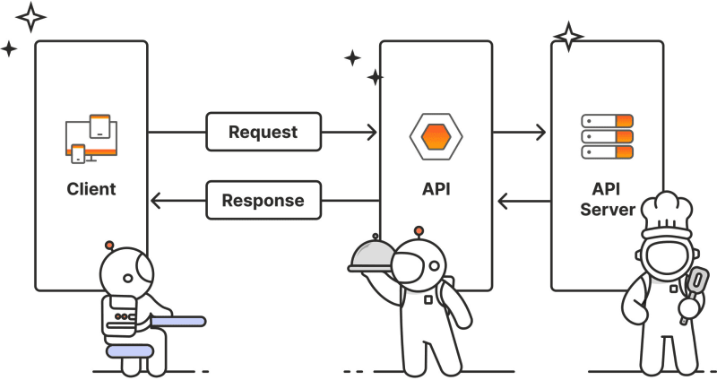

# Guide: API

This guide will introduce you to APIs, how they work, and how to use them in your projects.

## Introduction

APIs serve as a standardised way to bridge communication between different software systems, facilitating the exchange of data and functionality.

### When to use APIs

- Data retrieval: Fetching data from a database, third-party service, or CMS.
- Data submission: Sending data to a server.
- Service integration: A standardised way to interact with external services like authentication, payment gateways, social media platforms, analytics tools and more.

### How API endpoints work

Postman (a popular tool for testing APIs) has a [great article](https://blog.postman.com/what-is-an-api-endpoint/) about **how API endpoints work**, and **best practise for designing and developing** API's. Please read it to understand the basics of API's.

## Assignments

### 1. Use Postman to test APIs

Postman is a popular tool for testing APIs. You can use it to send requests to an API and inspect the responses.

1. Download and install [Postman](https://www.postman.com/).
2. Follow this ["send your first API request" guide](https://learning.postman.com/docs/getting-started/first-steps/sending-the-first-request/) to send a GET request to an API.
3. Verify that the API returns the expected response.
4. Replace the URL with another API endpoint and send a request to it - here's a list of [Public APIs](https://apipheny.io/free-api/) to test with.

### 2. Create your own API and todo list app

We suggest using [MockAPI.io](https://mockapi.io/) to create a simple API that returns a list of todo's. Mock API's are useful to create fake APIs when building websites and the real API is not ready yet.

1. Follow [MockAPI's quick start guide](https://github.com/mockapi-io/docs/wiki/Quick-start-guide) to create your API and define a new endpoint that returns a list of todo's.
2. Use Postman to test the API.
    - Use Postman to send a GET request to the endpoint you created and verify the response.
    - Then to send a POST request and verify the response.
3. Set up a new Vite + Vue project to render the todo's on a page
    - `npm create vite@latest` to create a new Vite project with Vue.
    - Use the [fetch api](https://developer.mozilla.org/en-US/docs/Web/API/Fetch_API/Using_Fetch) to GET the todo's from the MockAPI endpoint.
    - Render the todo's on a page.
    - Make a form that on submit use POST to add new todo in your MockAPI.

## Further reading

- [Postman: What is an API endpoint?](https://blog.postman.com/what-is-an-api-endpoint/).
- [MDN Web Docs: Fetch API](https://developer.mozilla.org/en-US/docs/Web/API/Fetch_API).

### Tools we like to use

- [Postman](https://www.postman.com/): API testing tool.
- [MockAPI.io](https://mockapi.io/): Create a mock API for testing.
- [JSONPlaceholder](https://jsonplaceholder.typicode.com/): Fake online REST API for testing and prototyping.

### Services we like to use

- [Storyblok](https://www.storyblok.com/): Headless CMS with a visual editor.
- [Firebase](https://firebase.google.com/): Backend as a Service (authentication, database, storage, hosting, and more).