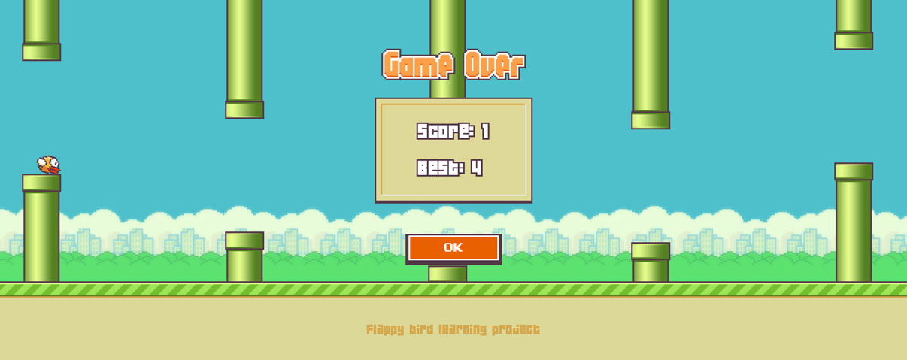

# Flappy bird learning project



## Running the project

```sh
npm install # Install dependencies
npm run dev # Compile and Hot-Reload for Development
npm run build # Compile and Minify for Production
```
## Overview

The project was set up using [create-vue](https://github.com/vuejs/create-vue), with only Pinia selected in the wizard. 

The intention of the project is to serve as an example of a simple game built in Vue, complete with user input, state management and animated graphics and sounds.

### Initial project cleanup
The initial project created with the scaffolding was cleaned up, removing existing components and creating the components ```Foreground.vue, Obstacle.vue & Player.vue```. ```base.css``` was deleted and ```main.css``` refactored for use in the game.

### App.vue
The entire game takes place on one page, and rendering logic is set up in ```App.vue```, which has been adapted form the original version.

User input (keyboard and touch events) are set up and managed here as well.

### Stores
The initial Pinia store ```counter.js``` was turned into ```scoreStore.js```with only a few modifications, managing the score of the game. A highscore data field was added and connected to localStorage, so that the higshcore is persistent accross sessions. 

 Additional stores ```obstacleStore.js, playerStore.js & gameStore.js``` handle all the state/data of the game.

### Game logic
The game logic is set up in ```gameLoop.js```, with a game loop running with ```requestAnimationFrame```. In the gameLoop script, stores are updated, collision & score is evaluated and game state is watched and updated each frame, depending on what happens in the game.


### Graphics and sounds
All assets have been adapted from Samuel Custodio's asset [flappy-bird-assets](https://github.com/samuelcust/flappy-bird-assets) repository.

A simple sound manager handles the sound effects of the game, with preloading and playing.